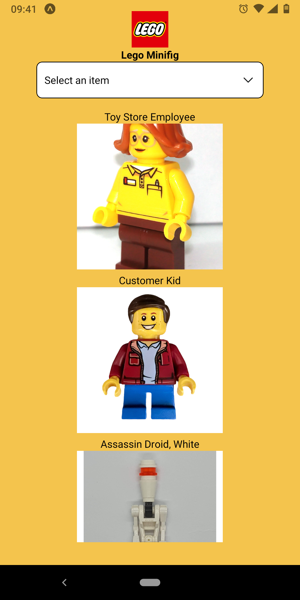
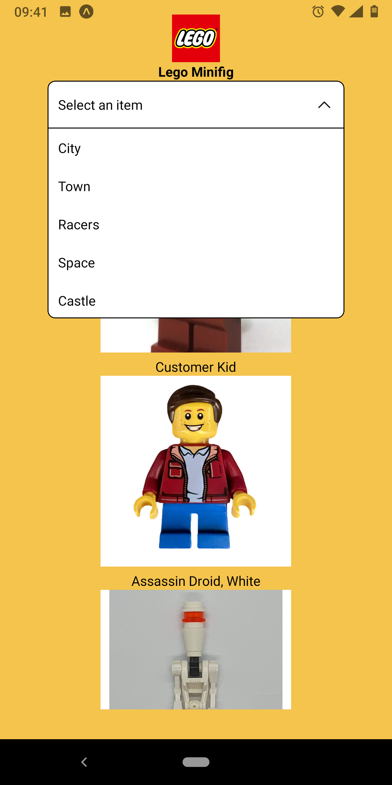
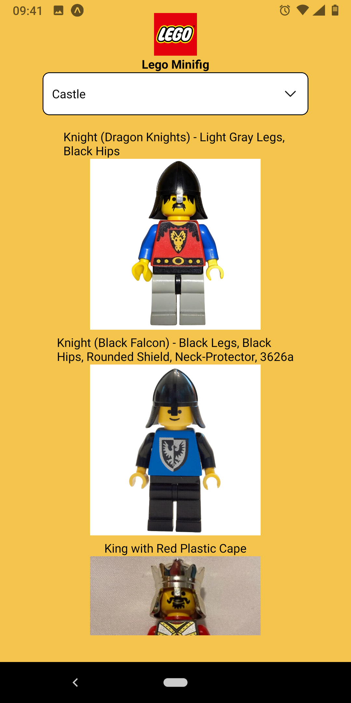

# Mobile-lego

A mobile application to see minifigures of lego

# Usage

On your phone, install Expo Go application

Clone this repository
```bash
npm start
```

Scan the QR code with Expo application

# View




