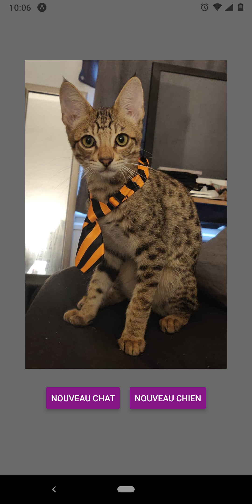
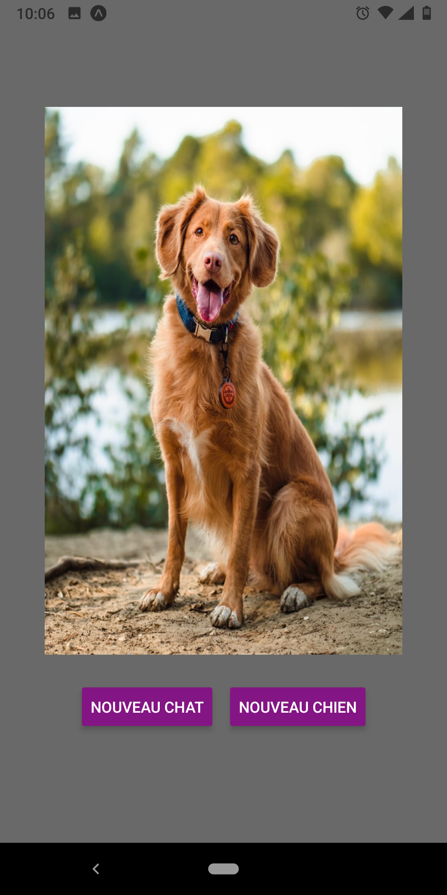

# Mobile-pets

first practice of React Native with https://api.thecatapi.com/ API

# Usage

On your phone, install Expo Go application

Clone this repository
```bash
npm start
```

Scan the QR code with Expo application

# View

<p align="center">
  
  
</p>
